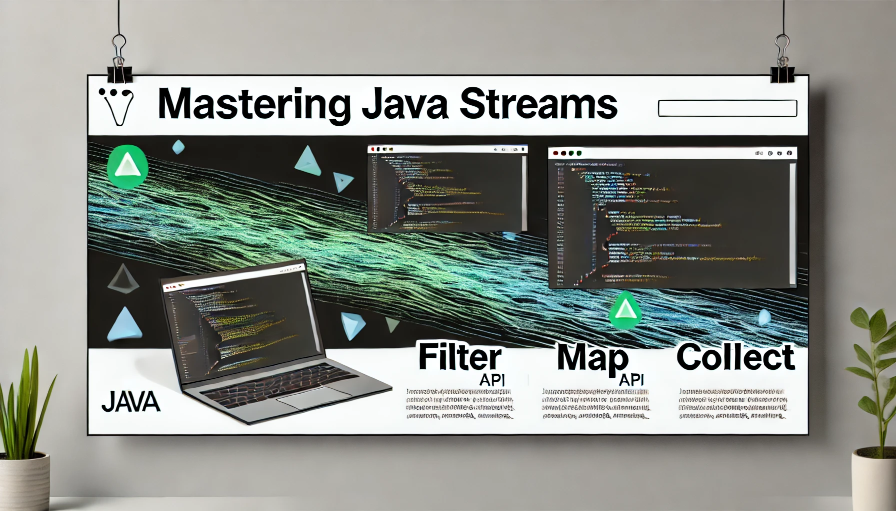
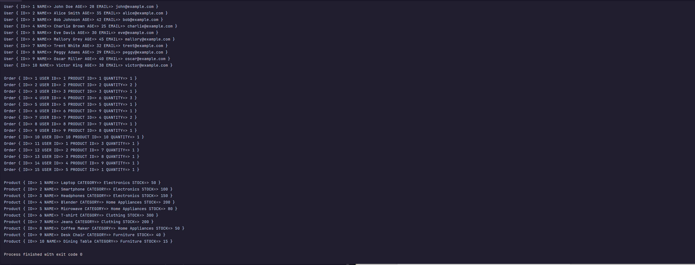
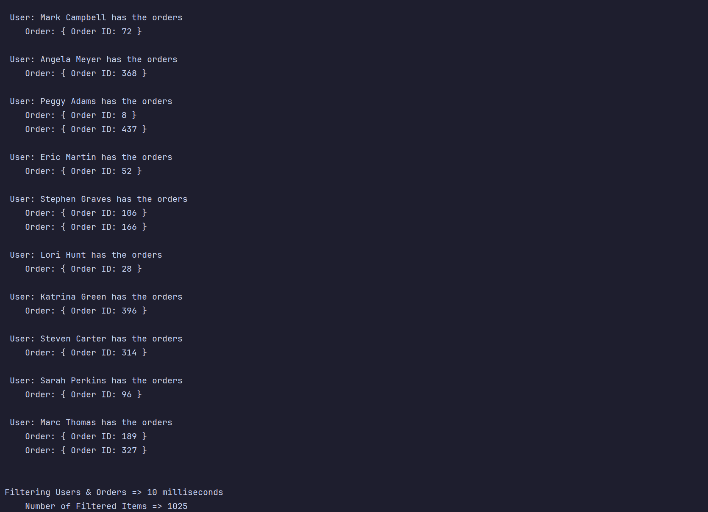

**Author:** [Greg Shenefelt](https://linkedin.com/in/greg-shenefelt) - **Date:** 10/5/24 _📧 [Email Me](mailto:greg@shenefelt.net)_

---

# Go with the Flow: Unlocking the Power of Java Streams for Effortless Data Processing



In the fast-paced world of Java Development, there's a tool that developers love to go with the flow - literally!
Say hello to Java Streams with a strong current it makes complex data processing look effortless.
Whether you're filtering, mapping, or crunching large data sets, 
Streams allow you to elegantly express your logic in a way that's both readable and efficient.

Gone are the days of writing cumbersome loops and conditionals just to sift through collections. **_(Sorry professor)_**
Java Streams give us the power to tackle data transformation in a sleek, functional programming style.
But what exactly makes Streams so special, and why should you be using them in your day-to-day code.

## Java Streams
Are one of many powerful tools for processing large sets of data in an efficient way. Offering us ways to cleanly filter,
map, and reduce datasets allowing you to boost performance while maintaining readable code. 

---

# A Fast Paced Stream
Consider these 3 separate collections (shortened for print output)


Now let's make all three collections have 500 elements each - then let's match the orders to the proper user.

You read it right **1025** items filtered and sorted in **10 milliseconds** talk about a strong current!

### The Stream
```java
    public void matchOrders(List<Order> o, List<User> u)
    {
        long start,end;

        start = currentTime();
        Map<User, List<Order>> orderedMap = u.stream().collect(
                Collectors.toMap(
                user -> user,
                user -> o.stream().filter(order -> order.getUserID() == user.getUserID()).collect(Collectors.toList())
        ));
        end = currentTime();
        filterTime = getTimeDiff(end, start);


        start = currentTime();
        orderedMap.forEach((user, userOrders) -> {
            if(userOrders.isEmpty()) return; // if the user doesn't have any orders skip them.

            System.out.println(" User: " + user.getName() + " has the orders");
            userOrders.forEach(order -> System.out.println(" \tOrder: { Order ID: " + order.getOrderID() + " }"));
            System.out.println();
        });
        end = currentTime();
        printTime = getTimeDiff(end, start);

        System.out.println();
        System.out.println("Filtering Users & Orders => " + filterTime + " milliseconds\n\tNumber of Filtered Items => " + (o.size() + u.size()));
        System.out.println("Printing Filtered Map => " + printTime + " milliseconds");

    }
```


